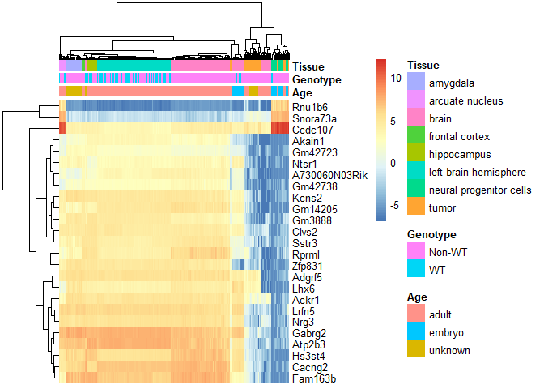
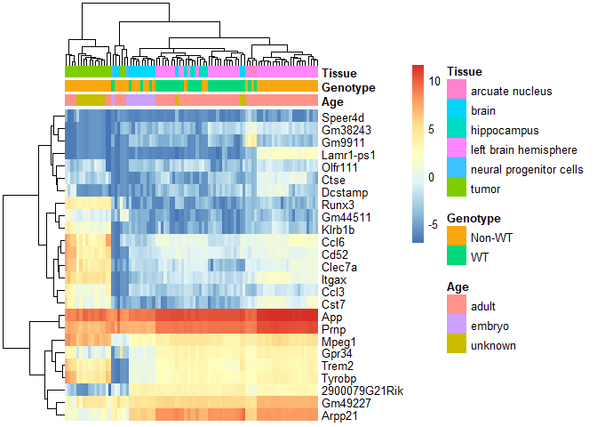

Brain Multi-studio analysis
================

<!-- README.md is generated fom README.Rmd. Please edit that file -->

# Multi studio analysis

:) <!-- badges: start --> <!-- badges: end -->

The goal of Multi studio analysis is to merge multiple Ilumina 4000 data
from mouse…

What is special about using `README.Rmd` instead of just `README.md`?
You can include R chunks like so:

# WT - Genotype

<!-- -->

# Female - Genotype

<!-- -->

# Male - Genotype

<!-- -->

In that case, don’t forget to commit and push the resulting figure
files, so they display on GitHub.
