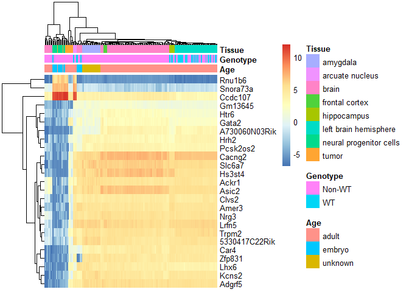

Brain Multi-studio analysis
================

<!-- README.md is generated fom README.Rmd. Please edit that file -->

# Multi studio analysis

:) <!-- badges: start --> <!-- badges: end -->

The goal of Multi studio analysis is to merge multiple Ilumina 4000 data
from mouse…

We merged the information of the following studios and based on their
genetic signature, we assigned sex on the mouses that did not have it
assigned:

SRA\_list &lt;- c(‘SRP215380’, ‘SRP128050’, ‘SRP199237’, ‘SRP152324’,
‘SRP152966’, ‘SRP131336’, ‘SRP130908’, ‘SRP100500’, ‘SRP125754’,
‘SRP174174’, ‘SRP099692’ )

# Model based on genotype

## WT - Genotype

<!-- -->

## Female - Genotype

<!-- -->

## Male - Genotype

<!-- -->

``` r
load("~/Miguel_Github/MERS_CoV_analysis/processed_data/df_female_age.RData")
load("~/Miguel_Github/MERS_CoV_analysis/processed_data/df_male_age.RData")
load("~/Miguel_Github/MERS_CoV_analysis/processed_data/df_WT_age.RData")

load("~/Miguel_Github/MERS_CoV_analysis/processed_data/exprs_heatmap_WT_age.RData")
load("~/Miguel_Github/MERS_CoV_analysis/processed_data/exprs_heatmap_male_age.RData")
load("~/Miguel_Github/MERS_CoV_analysis/processed_data/exprs_heatmap_female_age.RData")
```

# Model based on age

## WT - age

<!-- -->

## Female - age

<!-- -->

## Male - age

<!-- -->
